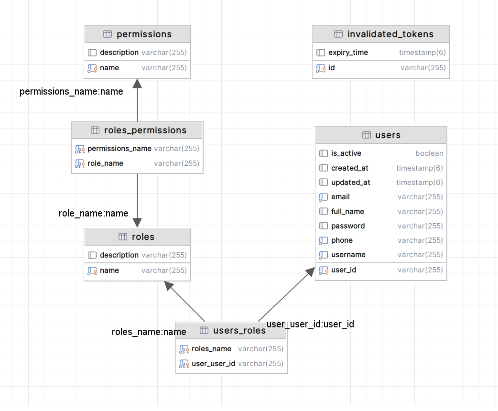

---

# Ứng Dụng Tìm Việc Jobtify

Jobtify là một nền tảng sáng tạo dành cho người tìm việc và nhà tuyển dụng, giúp người dùng quản lý quá trình tìm việc, kỹ năng và thông tin cá nhân một cách minh bạch và hiệu quả.

## Các Công Nghệ Sử Dụng

- **Java 21**
- **Redis**
- **Kafka**
- **PostgreSQL**
- **JWT**

## Mô tả tài liệu

### 1. **Database Diagram**


### 2. **Database Diagram**



  
### 3. **Deployment Diagram**


- Hệ thống được xây dựng theo kiến trúc microservices, mỗi dịch vụ như Dịch Vụ Xác Thực (Identity Service) và Dịch Vụ Jobtify (Jobtify Service) hoạt động độc lập và giao tiếp qua Kafka.
- Redis được sử dụng để lưu trữ dữ liệu truy cập thường xuyên, đảm bảo hiệu suất cao.
- PostgreSQL lưu trữ thông tin người dùng, công việc và các dữ liệu cần thiết khác.

## Triển Khai Trên Môi Trường Linux

Để triển khai ứng dụng trên môi trường Linux, hãy làm theo các bước dưới đây:

1. **Tạo Mạng Kafka**
    ```bash
    docker network create kafka-network
    ```

2. **Chạy Dịch Vụ Zookeeper**
    ```bash
    docker run -itd \
      --name zookeeper \
      --network kafka-network \
      -e ZOOKEEPER_CLIENT_PORT=2181 \
      confluentinc/cp-zookeeper
    ```

3. **Chạy Dịch Vụ Kafka**
    ```bash
    HOST_IP=$(hostname -I | awk '{print $1}')
    docker run -itd \
      --name kafka \
      --network kafka-network \
      -e KAFKA_ZOOKEEPER_CONNECT=zookeeper:2181 \
      -e KAFKA_ADVERTISED_LISTENERS=PLAINTEXT://{HOST_IP}:9092 \
      -e KAFKA_OFFSETS_TOPIC_REPLICATION_FACTOR=1 \
      -p 9092:9092 \
      confluentinc/cp-kafka
    ```

4. **Tạo Kafka Topic**
    ```bash
    docker exec kafka kafka-topics --create \
      --topic user-create-topic \
      --bootstrap-server localhost:9092 \
      --partitions 1 \
      --replication-factor 1
    ```

5. **Chạy Dịch Vụ Redis**
[File cấu hình redis: Nếu dùng file cấu hình này không cần thay đổi username, password, port Redis](assets/redis.conf) 
    ```bash
    docker run -d --name redis-stack -p 6379:6379 -p 8001:8001 -v <File-Cấu-Hình-Redis.conf>:/etc/redis/redis.conf redis/redis-stack:latest
    ```

6. **Chạy Dịch Vụ PostgreSQL**
    ```bash
    docker run -itd -e POSTGRES_USER=jiag -e POSTGRES_PASSWORD=20053331 -p 5432:5432 -v /home/$USER/postgresql/data:/var/lib/postgresql/data --name postgresql postgres:17.0-bookworm
    ```

## Thay Đổi Cấu Hình

Sau khi cài đặt các dịch vụ, bạn cần chỉnh sửa các file `application.yml` của Dịch Vụ Xác Thực và Dịch Vụ Jobtify để tích hợp các cấu hình môi trường.

[Identity service - application.yml](identity-service/src/main/resources/application.yml)
[Jobtify service - application.yml](jobtify-service/src/main/resources/application.yaml)

## Thực hiện các service

## Ảnh Màn Hình


---
